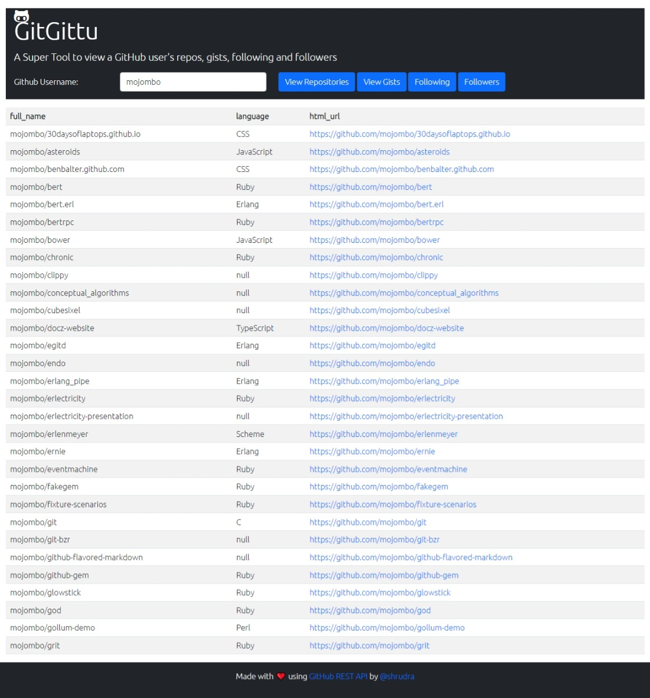
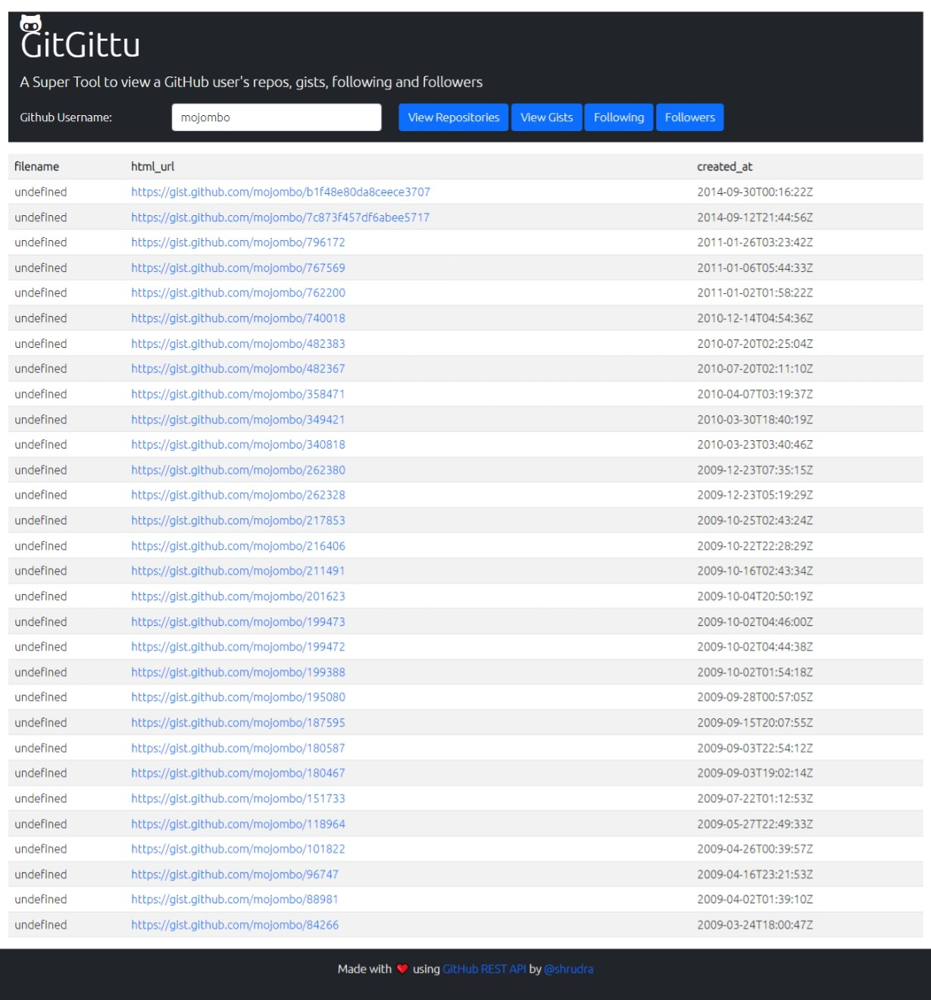

# GitGittu

[](https://opensource.org/licenses/MIT)

GitGittu is a simple tool that allows users to view their GitHub repositories, gists, followers, and following. The tool is built with JavaScript and utilizes the GitHub REST API.

## Usage

To use the tool, simply visit the [GitGittu website](https://shrudra.github.io/gitgittu/) and enter your GitHub username in the input field. Then click on the button for the information you want to view: Repositories, Gists, Followers, or Following. The information will be displayed in a table format below the button.

## Screenshots

### Repositories


### Gists


### Followers


### Following


## Development

If you want to make modifications to GitGittu, you can clone the GitHub repository and make changes locally. Here are the steps to do so:

1. Clone the repository:

    ```
    git clone https://github.com/shrudra/gitgittu.git
    ```

2. Open the index.html file in your browser to view the current version of the tool.

3. Make any changes you want to the JavaScript code in the main.js file.

4. Test your changes by refreshing the index.html file in your browser.

5. Once you're satisfied with your changes, commit and push them to the GitHub repository:

    ```
    git add .
    git commit -m "Description of changes made"
    git push
    ```

## Contribute

If you find any bugs or want to contribute to the project, feel free to submit an issue or pull request.

## License
My Tool is licensed under the MIT License. See <a href="LICENSE">LICENSE</a> for more information.

## Contact

If you have any questions or want to reach out, you can email me at [sakhwt.hssain@gmail.com](mailto:sakhwt.hssain@gmail.com).

